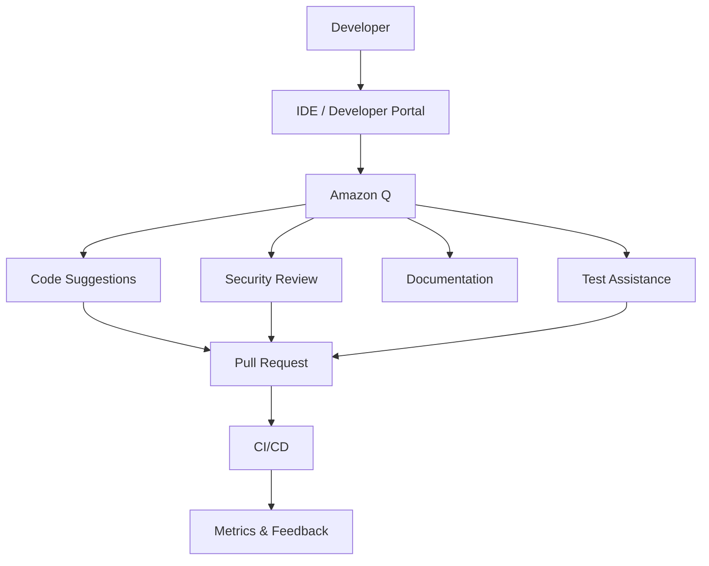

# Amazon Q for Development and Security

A pattern for integrating AI assistance into development, security reviews, and engineering workflows.

## Diagram

## Use Cases

- Code generation support
- Vulnerability explanation
- Test case generation
- Documentation assistance
- Faster onboarding
