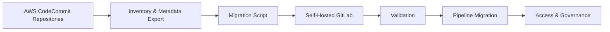

# CodeCommit to Self-Hosted GitLab Migration

A DevOps migration pattern for moving repositories from AWS CodeCommit to self-hosted GitLab.

## Diagram

## Migration Checklist

- Inventory repositories and branches
- Validate access permissions
- Clone/mirror repositories
- Create GitLab projects/groups
- Push all branches and tags
- Validate commit history
- Migrate CI/CD pipelines
- Update remote URLs
