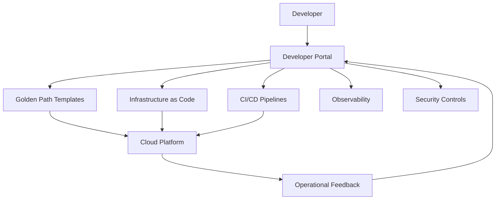

# Internal Developer Platform Pattern

A reference model for self-service engineering platforms.

## Diagram

```mermaid
flowchart TD
    Dev[Developer] --> Portal[Developer Portal]
    Portal --> Templates[Golden Path Templates]
    Portal --> CICD[CI/CD Pipelines]
    Portal --> IaC[Infrastructure as Code]
    Portal --> Obs[Observability]
    Portal --> Sec[Security Controls]
    Templates --> Cloud[Cloud Platform]
    IaC --> Cloud
    CICD --> Cloud
    Cloud --> Feedback[Operational Feedback]
    Feedback --> Portal
```
